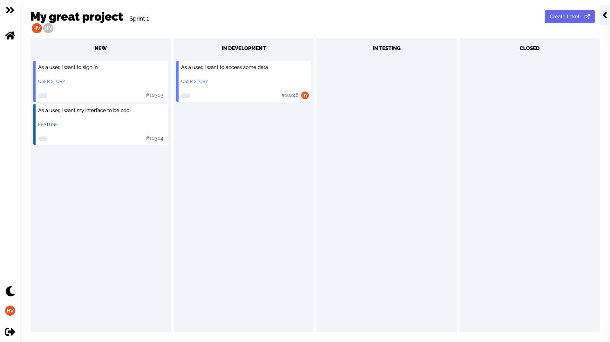
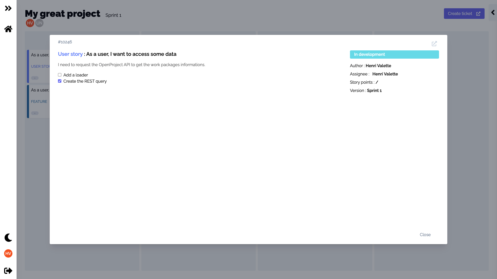
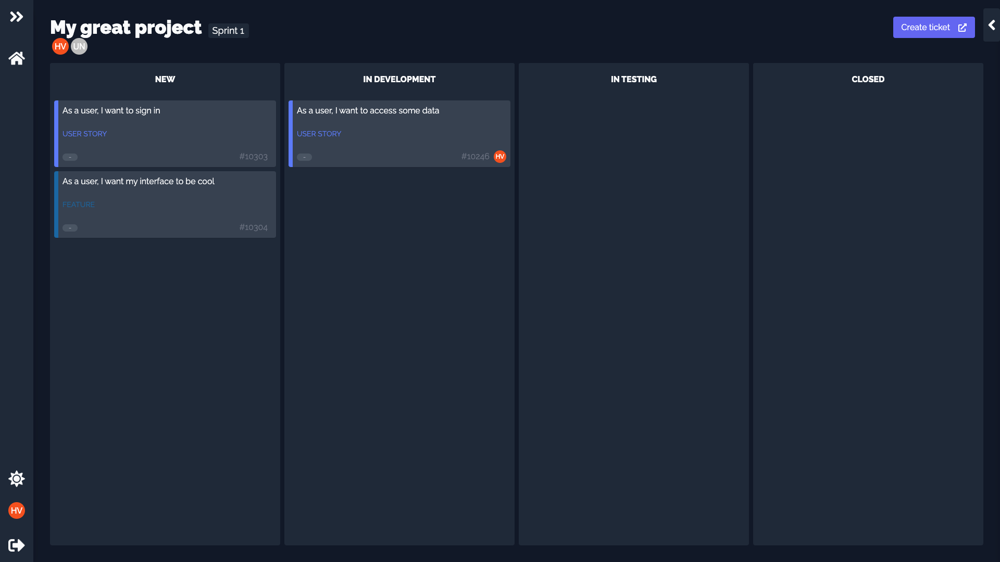

# Open Kanban

An kanban interface for [OpenProject](https://www.openproject.org).

## Features

Open Kanban allows you to visualize your projects in a kanban



Interact with User Stories with drag and drop, mark task as done with checkboxes and assign users.



Rest your eyes with a nice dark mode.



## Installation

This is a [Next.js](https://nextjs.org/) project bootstrapped with [`create-next-app`](https://github.com/vercel/next.js/tree/canary/packages/create-next-app).

### Environment variables

```env
OP_CLIENT_ID=
OP_CLIENT_SECRET=
NEXT_AUTH_SECRET=
NEXT_PUBLIC_OP_URL=
```

For OP_CLIENT_ID and OP_CLIENT_SECRET, follow the [documentation](https://www.openproject.org/docs/system-admin-guide/authentication/oauth-applications/) to get your client id and secret.

NEXT_AUTH_SECRET, generate a unique secret. You can use :

```
openssl rand -base64 32
```

For NEXT_PUBLIC_OP_URL, it's your open project URL.

### Local

Clone this repository

Install dependancies

```bash
npm install
```

Run the dev server

```bash
npm run dev
```

### Deploy on Vercel

The easiest way to deploy your Next.js app is to use the [Vercel Platform](https://vercel.com/new?utm_medium=default-template&filter=next.js&utm_source=create-next-app&utm_campaign=create-next-app-readme) from the creators of Next.js.

Check out our [Next.js deployment documentation](https://nextjs.org/docs/deployment) for more details.
